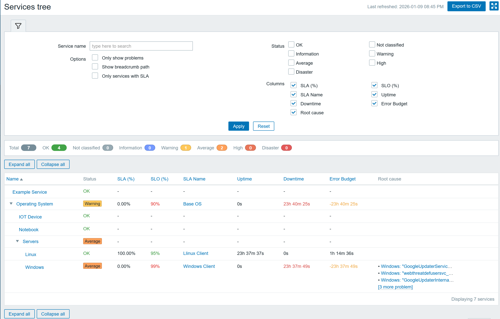

# zabbix-module-service-tree

Service Tree adds a Services tree view to Zabbix (Services -> Services tree). It renders IT Services as a parent/child tree with SLA metrics, root causes, and powerful filtering. 

## Screenshot

## Requirements
- Zabbix 7.0 (frontend module)
- IT Services configured (Services, SLAs)

## Installation
1) Create a folder in your Zabbix server modules folder (by default `/usr/share/zabbix/`) and copy contents of this repository into folder `zabbix-module-service-tree`.
2) Go to Administration -> General -> Modules, click Scan directory and enable the module.
3) Open Services -> Services tree.

## Usage 
- Use the filter panel to search, filter by severity, and toggle columns.
- Expand/collapse branches with the arrows or the Expand all / Collapse all buttons.
- Click service names to open the standard Service view.
- Click SLA names to open the SLA report.
- Export the current table view with Export CSV.

## Features
- Tree view of IT Services (strict tree, single parent).
- Search by service name (wildcards enabled).
- Status filter (multiple severities).
- Options:
  - Only show problems
  - Show breadcrumb path
  - Only services with SLA (keeps tree structure by retaining parents)
- Column toggles:
  - SLA (%), SLO (%), SLA Name
  - Uptime, Downtime, Error Budget
  - Root cause
- Root cause list:
  - Sorted by severity
  - Links to the triggering event
  - Compact list with a ?[x more problem]? hint showing all items
- Status summary bar with counts by severity and total.
- Sorting by Name and SLA columns.
- CSV export of visible table columns (supports full breadcrumb path).
- Remembers expanded branches and filter settings via cookies.

## SLA data
- SLA metrics are fetched from the SLA configuration (SLA + Services).
- SLA percentage is shown with two decimals.
- Downtime and Error Budget use the same formatting as the SLA report.
- If SLA columns are hidden, SLA API calls are skipped to speed up loading.

## Root cause data
- Root causes are derived from Service problem tags and correlated problems.
- If the Root cause column is hidden, root cause queries are skipped.

## Performance notes
- SLA and root cause data are loaded only for visible (expanded) rows.
- Sorting by SLA columns loads SLA data for all rows to keep sorting accurate.

## Permissions
The module uses standard Zabbix permissions for Services and Problems.

## Credits 
Credit to [Monzphere](https://monzphere.com/modulo/service-tree) for the insiration of the template. See also [this blog article](https://whatsuphome.fi/whatsuphome/part126
)

Big thanks to [@BGmot](https://github.com/BGmot) for the  [zabbix-module-hosts-tree](https://github.com/BGmot/zabbix-module-hosts-tree) module that was used as base for the development.